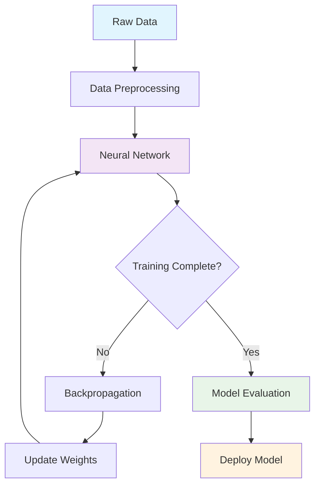
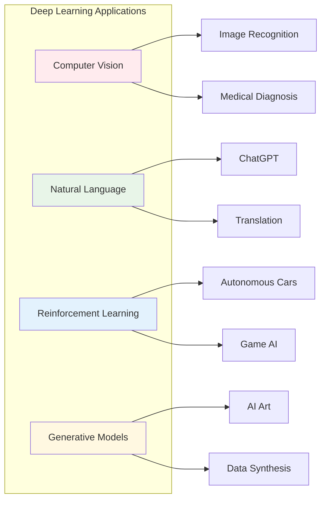

---
# try also 'default' to start simple
theme: seriph
# random image from a curated Unsplash collection by Anthony
# like them? see https://unsplash.com/collections/94734566/slidev
background: https://source.unsplash.com/collection/94734566/1920x1080
# apply any windi css classes to the current slide
class: 'text-center'
# https://sli.dev/custom/highlighters.html
highlighter: shiki
# show line numbers in code blocks
lineNumbers: false
# some information about the slides, markdown enabled
info: |
  ## Deep Learning Overview
  A comprehensive introduction to deep learning concepts and applications.

  Learn more at [Sli.dev](https://sli.dev)
# persist drawings in exports and build
drawings:
  persist: false
---

# Welcome to Deep Learning

Understanding Neural Networks and Modern AI

<div class="pt-12">
  <span @click="$slidev.nav.next" class="px-2 py-1 rounded cursor-pointer" hover="bg-white bg-opacity-10">
    Press Space for next page <carbon:arrow-right class="inline"/>
  </span>
</div>

<div class="abs-br m-6 flex gap-2">
  <button @click="$slidev.nav.openInEditor()" title="Open in Editor" class="text-xl icon-btn opacity-50 !border-none !hover:text-white">
    <carbon:edit />
  </button>
  <a href="https://github.com/tensorflow/tensorflow" target="_blank" alt="TensorFlow"
    class="text-xl icon-btn opacity-50 !border-none !hover:text-white">
    <carbon-logo-github />
  </a>
</div>

<!--
Deep learning is revolutionizing how machines understand and process information, from computer vision to natural language processing.
-->

---

# What is Deep Learning?

Deep learning is a powerful subset of machine learning inspired by the human brain, consisting of the following key aspects

- 🧠 **Neural Networks** - multi-layered artificial neurons that process information
- 📊 **Pattern Recognition** - automatically discovers complex patterns in data
- 🔄 **Backpropagation** - learning algorithm that optimizes network weights
- 🎯 **Feature Learning** - extracts meaningful representations without manual engineering
- ⚡ **Scalability** - leverages GPU computing for massive parallel processing
- 🌐 **Versatility** - applicable across vision, language, speech, and decision-making

<br>
<br>

Read more about [Why Deep Learning?](https://www.deeplearningbook.org/)

<!--
Deep learning has transformed AI by enabling machines to learn hierarchical representations of data, leading to breakthroughs in computer vision, natural language processing, and many other domains.
-->

<style>
h1 {
  background-color: #2B90B6;
  background-image: linear-gradient(45deg, #4EC5D4 10%, #146b8c 20%);
  background-size: 100%;
  -webkit-background-clip: text;
  -moz-background-clip: text;
  -webkit-text-fill-color: transparent; 
  -moz-text-fill-color: transparent;
}
</style>

---
layout: image-right
image: https://source.unsplash.com/1920x1080/?artificial-intelligence,neural-network
---

# Neural Architecture

Build powerful models with layered networks![^1]

```python {all|2|1-6|9|all}
import tensorflow as tf

# Define neural network layers
model = tf.keras.Sequential([
    tf.keras.layers.Dense(128, activation='relu'),
    tf.keras.layers.Dropout(0.2),
    tf.keras.layers.Dense(64, activation='relu'),
    tf.keras.layers.Dense(10, activation='softmax')
])

# Compile and train
model.compile(optimizer='adam',
              loss='categorical_crossentropy',
              metrics=['accuracy'])
```

<arrow v-click="3" x1="400" y1="420" x2="230" y2="330" color="#564" width="3" arrowSize="1" />

[^1]: [Learn More](https://www.tensorflow.org/guide/keras)

<style>
.footnotes-sep {
  @apply mt-20 opacity-10;
}
.footnotes {
  @apply text-sm opacity-75;
}
.footnote-backref {
  display: none;
}
</style>

---
layout: center
class: text-center
---

# The Future is Here

<div class="grid grid-cols-2 gap-10 pt-4 -mb-6">

<div>



</div>

<div>



</div>

</div>

<div class="mt-8 text-center">

**Ready to build the future with AI?**

[TensorFlow](https://tensorflow.org) · [PyTorch](https://pytorch.org) · [Hugging Face](https://huggingface.co) · [Papers With Code](https://paperswithcode.com)

</div>