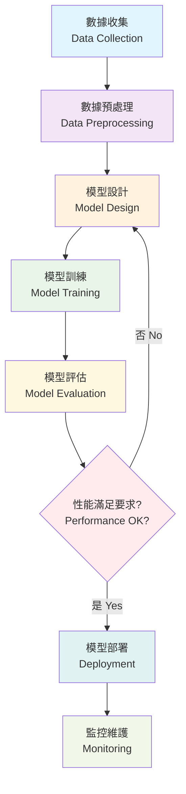

# Deep Learning Revolution
## Transforming AI with Neural Networks

  
    開始探索 <carbon:arrow-right class="inline ml-2"/>
  

---
layout: default
---

# 什麼是深度學習？

## 核心概念

- 🧠 **神經網路**  
  多層人工神經元結構

- 📊 **模式識別**  
  自動發現複雜模式

- 🔄 **反向傳播**  
  權重優化演算法

- 🎯 **特徵學習**  
  自動提取表示特徵

- ⚡ **GPU 加速**  
  大規模平行處理

## 主要優勢

- **自動特徵工程**  
  無需手動特徵提取

- **可擴展性能**  
  隨數據增加而改善

- **遷移學習**  
  重複使用預訓練模型

- **端到端學習**  
  直接輸入到輸出映射

- **最先進結果**  
  各領域領先性能

---
layout: center
class: text-center
---

# 深度學習開發流程

---
layout: two-cols
---

# 應用領域

## 🖼️ 電腦視覺
- 圖像分類
- 物體檢測
- 醫學影像分析
- 自動駕駛

## 💬 自然語言處理
- ChatGPT 與大語言模型
- 機器翻譯
- 情感分析
- 文本生成

::right::

## 🎵 音訊處理
- 語音識別
- 音樂生成
- 語音合成
- 音訊分類

## 🎮 強化學習
- 遊戲 AI (AlphaGo)
- 機器人控制
- 交易系統
- 資源優化

---
layout: center
class: text-center
---

# 熱門深度學習框架

  
  <h3>TensorFlow</h3>
  
Google 開發的開源機器學習平台

  
  <h3>PyTorch</h3>
  
Facebook 開發的動態神經網路框架

  
🔥

  <h3>Keras</h3>
  
高級神經網路 API

  
🤗

  <h3>Hugging Face</h3>
  
自然語言處理模型庫

---
layout: center
class: text-center
---

# 深度學習的未來

  
🚀

  <h3>更強大的模型</h3>
  
GPT-4、Claude 等大型語言模型持續進化

  
⚡

  <h3>更高效的計算</h3>
  
專用 AI 晶片和量子計算的發展

  
🌍

  <h3>更廣泛的應用</h3>
  
從科學研究到日常生活的全面滲透

  <h2 class="text-2xl font-bold mb-4">謝謝聆聽！</h2>
  
Questions & Discussion

